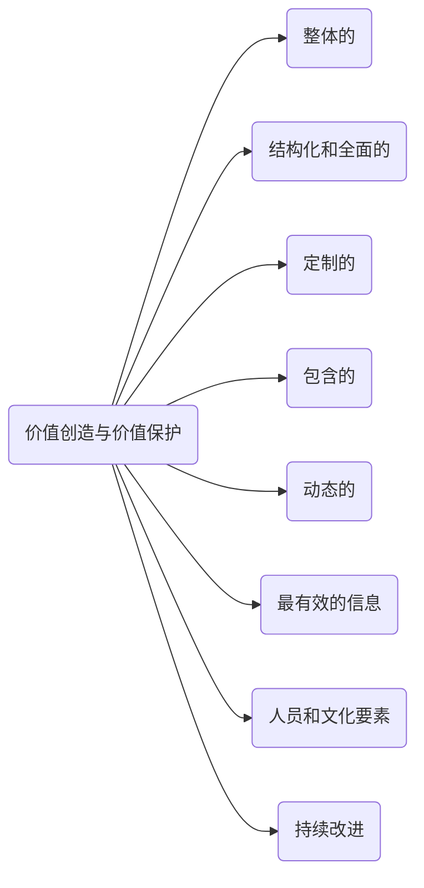

ISO：31000-2018 Risk Management-Guideline读书笔记

* content
{:toc}

## 概述

### 标准的结构

本标准是分成了三个相互联系的部分进行描述的，分别是principles（理论)，framework（框架），process（过程）.

### 什么是风险

标准里原文如下：

> risk - effect of uncertainty on objectives.

风险就是对目标的不确定性的影响。

1. 影响是期望的偏离。它可能是正面的，负面的或者两者都有，它能被解决，创造，并导致机会或威胁。
2. 目标可以有不同的方面和类别，并可以应用于不同的级别。
3. 风险可以采用四个参数来表征：风险源、可能的事件、导致的后果和发生的可能性。

- 风险源：独立的或者组合的要素，该元素有导致风险的可能性。
- 事件：特定情况集合的发生或改变，事件可能会发生一次或数次，并可能会有多个原因和结果；事件可能是期望发生但是没有发生的，或者是期望不发生但是发生的；事件也可以是风险源。
- 导致的后果： 对目标产生影响的事件的结果。结果可能是正面的或者负面的，可能是确定的或者不确定的；可以定量或定性的表示；任何后果都能通过集联和累积效应导致升级。

## 理论

风险管理的目的是保护和创造价值。它改进效率，鼓励创新并支持目标达成。

1. 整体的：风险管理是组织行为的一部分。
2. 结构化和综合的：结构化和全面的风险管理方法有助于取得持续的和可比较的结果。
3. 
