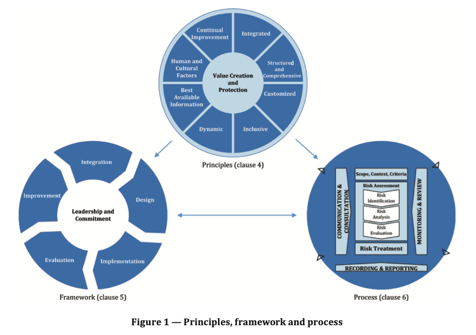
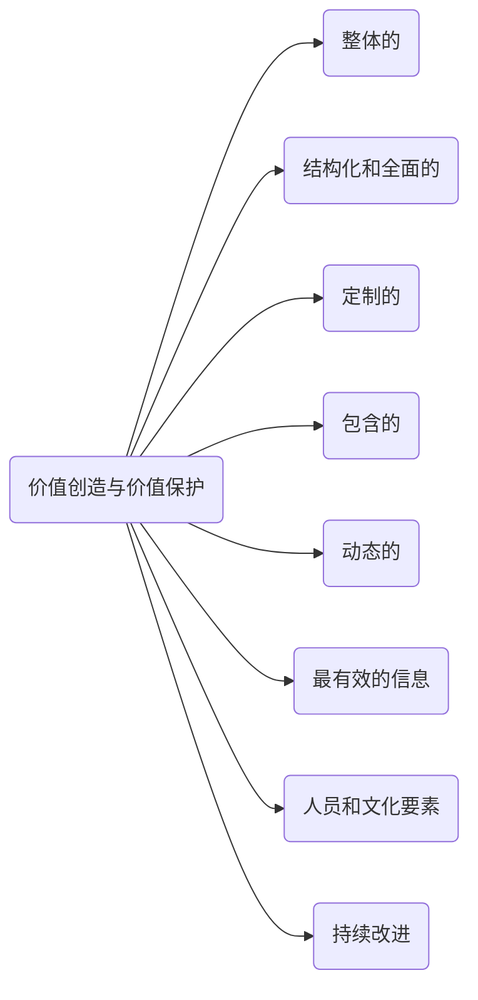
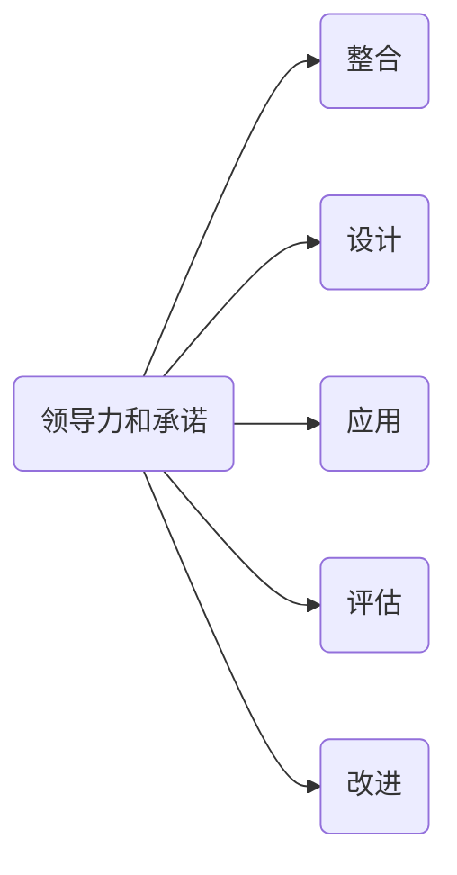

ISO：31000-2018 Risk Management-Guideline读书笔记

* content
{:toc}

## 概述

### 标准的结构

本标准是分成了三个相互联系的部分进行描述的，分别是principles（理论)，framework（框架），process（过程）.

### 什么是风险

标准里原文如下：

> risk - effect of uncertainty on objectives.

风险就是对目标的不确定性的影响。

1. 影响是期望的偏离。它可能是正面的，负面的或者两者都有，它能被解决，创造，并导致机会或威胁。
2. 目标可以有不同的方面和类别，并可以应用于不同的级别。
3. 风险可以采用四个参数来表征：风险源、可能的事件、导致的后果和发生的可能性。

- 风险源：独立的或者组合的要素，该元素有导致风险的可能性。
- 事件：特定情况集合的发生或改变，事件可能会发生一次或数次，并可能会有多个原因和结果；事件可能是期望发生但是没有发生的，或者是期望不发生但是发生的；事件也可以是风险源。
- 导致的后果： 对目标产生影响的事件的结果。结果可能是正面的或者负面的，可能是确定的或者不确定的；可以定量或定性的表示；任何后果都能通过集联和累积效应导致升级。

## 理论

风险管理的目的是保护和创造价值。它改进效率，鼓励创新并支持目标达成。

1. 整体的：风险管理是组织行为的一部分。
2. 结构化和综合的：结构化和全面的风险管理方法有助于取得持续的和可比较的结果。
3. 定制的：风险管理框架和过程是定制的，适合企业目标的内外部环境。
4. 包含的：涉众的适当与及时的参与能够让他们的视角、知识和看法得到有效的考虑。这能有效的促进风险管理的意识和认知的提升。
5. 动态的：当组织的外部和内部环境改变，风险可能会出现，改变和消失。风险管理应以某种合适和及时的方式进行预测、探知、确认和响应。
6. 最有效的信息：风险管理的输入是基于历史和现在的信息，以及未来的期望。风险管理必须考虑清楚有关这些信息和期望的限制和不确定性。信息对于有关涉众必须及时、清晰和有效。
7. 人力资源和文化要素：人员行为和文化会对风险管理的每一层级造成明显的影响。
8. 持续改进：风险管理需要在学习和实践中持续改进。

## 框架

风险管理框架的目的是帮助组织，将风险管理集成到主要行为和功能上。风险管理的效能取决于它融入组织治理，包含各项决策的程度。这就需要涉众的支持，特别是顶层管理者。

### 领导力和承诺

高层管理者和其他相关的全面管理者，应该确认风险管理已经集成到所有组织行为，并且通过以下形式对领导力和承诺进行了陈述：

- 定制和实施框架的所有组件
- 发表一个声明或政策，其内容是建立一个风险管理方法，计划或行动方针
- 确保分配给风险管理的必须的资源
- 在组织的不同层级分配授权，责任和问责制

### 整合

风险管理的整合依赖于对组织结构和环境的理解。结构的差异取决于组织的目的，目标和复杂度。风险在组织结构的每一部分进行管理。组织中的每一个人都对风险管理负有责任。

将风险管理整合到组织中是一个动态且迭代的过程，它应当根据组织的需求和文化进行定制。风险管理应当作为组织的目标，管理，领导和承诺，策略，目标和方法的一部分，而不是单独存在。

### 设计

当需要设计风险管理框架时，需要做到以下几点：
 - 首先需要考虑组织的内外部环境
 - 理清风险管理的承诺，可以通过相关规定，声明或者其他形式
 - 

