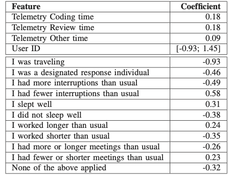

《Mind the Gap: On the Relationship Between Automatically Measured and Self-Reported Productivity》 读书笔记

* content
{:toc}

这两天阅读了Moritz Beller写的一篇论文《Mind the Gap: On the Relationship Between Automatically Measured and Self-Reported Productivity》，文中对于自动测量生产率和手动生产率的优劣势和作者的调查进行了一定的阐述，其中的一些调查数据挺有意义的，所以写一篇笔记记录一下。

## 自动测量和自我测量

目前流程的生产率测量方式有两种，自动测量和自我评价。

- 自动测量：产品或过程的特征（如每天完成的代码行数）自动度量以评估生产率，有时也被称为传统测量或客观测量。
- 自我评价：由软件工程师自己对生产率进行评价。

## 自动测量的优缺点

优点：十分方便的得到一个看似客观的结果。

缺点：
1. 方法的评价自身就存在主观因素，且存在问题
2. 很容易做假
3. 无法体现屏幕外的工作，如讨论、分析等

## 自我评价的优缺点

优点：能避免自动测量的一些缺点    
缺点：容易产生认知偏差，无法横向比较

## 调查研究

作者启动了一项基于windows开发人员的调查研究，他选择了1066个windows的软件开发人员作为样本总体，从中抽取了81个人员进行调查。在抽取的人员中，平均从事软件开发的年限为8年，其中最长的26年，最短的1年。调查持续了5周，最终收集了1479份问卷，以及其他各种过程信息。

收集信息的手段主要有以下几种：

1. 每天的问卷邮件

参与人员每天都要反馈一个问卷，问卷如图1所示，分成了两部分，左边为自我评价，由参与者给自己的生产率打一个分，从1星到5星，右边是对影响因素进行选择，其中给出了若干项影响生产率的因素选项。

2. 窗体记录

他们采用了一个微软内部的小工具，记录参与人员当前活动的app信息，并对app进行分类，例如编码工具、调试工具、测试工具、网页工具等，从而得出参与者从事各项工作的时间长度。

3. 其他信息来源

版本管理工具中的信息，代码分析工具中的信息，outlook中的会议信息与日程信息等。

## 信息的建模

他们采用了线性模型，来研究各项因素对生产率的影响。最终结果如下表所示：

结果的解释大致有这样几方面：

1. 编码时间基本最能体现生产率，编码时间越长，生产率越高
2. 加入窗体记录中的其他数据，在编码时间之外对于模型拟合的帮助提升不大
3. 个人评价打分差异巨大
4. 会议数据基本和生产率的最终结果无关，所以弃用
5. 出差会极大的影响生产率
6. 随时待命的状态会严重影响生产率，这也间接说明了为什么在家工作生产率并不高的原因
7. 减少打扰能极大的提升生产率，而增加打扰的次数会明显的降低生产率
8. 良好的睡眠可以明显的提高生产率

具体的影响因子可以参考上面的表格。

