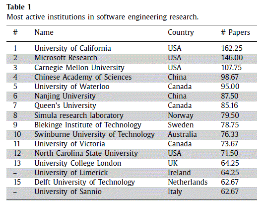
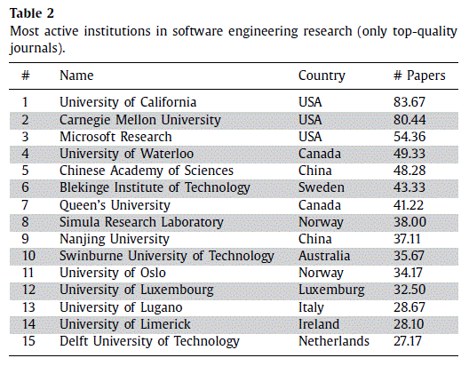
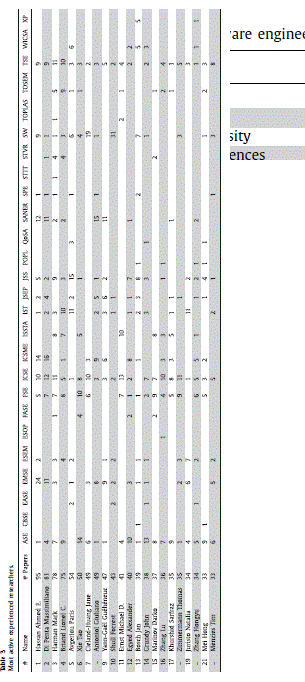
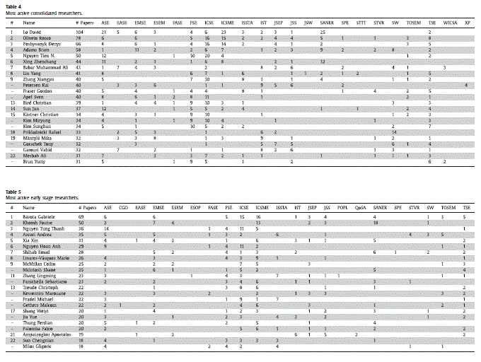
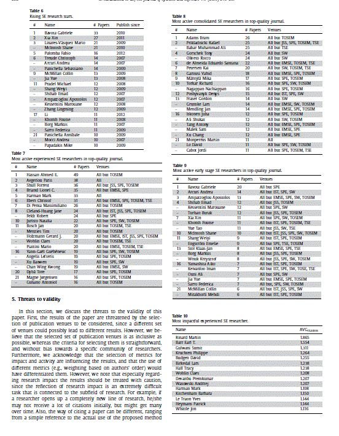
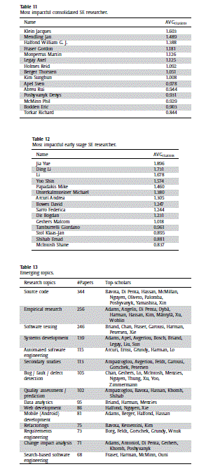
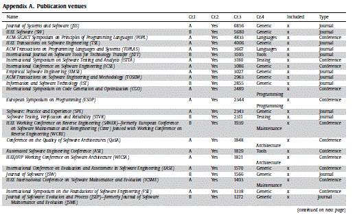

* contents
{:toc}

这两天读了 《A bibliometric assessment of software engineering scholars and institutions(2010-2017)》,记录一下。

## 概述

软件工程自从1960年代起，一直发展的很迅速。软件工程的重要程度在这几十年中一直在加强。为了了解软件工程领域中在近期又有了哪些最尖端的进展，分析顶会和顶刊中公开发表的论文被认为是一个合理有效的方式。这项评估为刊物的不同研究急速背景的读者提供了一个重要的参考，来帮助他们顺利的参与到软件工程领域研究中。这项研究自Glass在1994年发表了第一篇报道。它尝试回答两个著名的问题：（1）谁是系统和软件工程领域最有名的学者；（2）最有名的研究机构是哪个。

## 方法

- 对顶级学者和研究机构的评估基于14456篇公开发表的会议和刊物论文（2010-2017）
- 两个估计因素：研究成果和研究影响两方面来对学者进行综合分析
- 对于学者的不同时期的研究行为，我们提出了一个分类机制，将其分成早期、整合期和经验期。这种分类机制以更精确的方式进行过程评估
- 我们还将调查每一个作者的文章分布，来看他是在同一领域还是不同领域。

## 目标

 - 如果按照发表的成果数量来算，当前最活跃的软件工程研究中心是哪个
 - 在软件工程领域，如何划分专家的级别更合理
 - 在早期、整合期和经验期中最活跃的专家是谁？
 - 近三年中，在早期、整合期和经验期中最活跃的专家是谁？
 - 只考虑刊物中的论文发表的话，在早期、整合期和经验期中最活跃的专家是谁？
 - 在软件工程领域中，在早期、整合期和经验期中最有影响力的专家是谁？

## 结果

不写过程了，直接上结果

