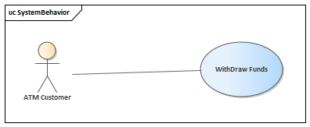
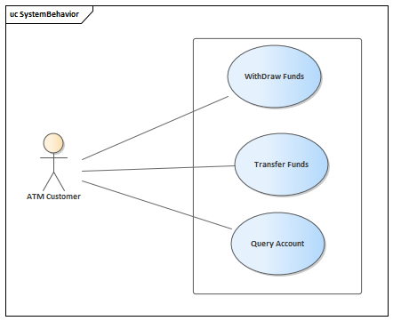
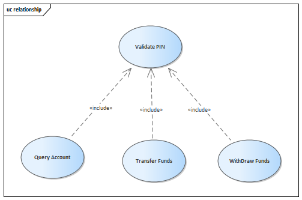

* content
{:toc}

简单的说一说系统建模。

## 什么是功能需求

系统的功能需求，也叫外部需求，它定义了系统将为用户做些什么。在定义外部需求的时候，系统将被看成一个黑箱，因此，在系统功能需求的定义阶段，我们只考虑系统的外部特征。

在这里需要注意的是，在系统功能需求分析的时候，我们的着眼点应该是系统具体实现了哪些功能，这些功能应该是满足涉众的某项“期望”的。这些期望应该是实现了某些价值，而不是实现价值的“步骤”。举个简单的例子，我们去医院，期望是“治病”，而不是“挂号”。因此，我们如果对医院做系统功能需求分析，其需求应该是“治病”，而不是“挂号”，挂号只是一个“步骤”，而不是系统的功能，也不是涉众的“需求”。

所以，我们做系统分析（建模）的第一步，就是分析清楚，我们的目标系统到底是做什么的。

> ** GJB 438B的相关内容 **
> GJB 438B中对于软件需求的模板中，存在内部接口需求和内部数据需求的内容，但是在438B的描述中也说明了这些内容可以放在设计中进行描述。我对此的理解是，如果是系统由于种种原因（比如延续性的设计，行业规范等）将内部数据和内部接口确定，则在这里应该予以描述，否则就应该放在设计阶段再进行完善。

## 定义

### 用例（use case）

用例定义了一个或多个行为者与系统之间的交互序列。在需求阶段，用例模型系统看成一个黑箱，并且将行为和和系统之间的交互描述为叙述性的用户输入和系统响应。用例的图示用一个椭圆表示。

### 行为者（actor）

一个行为者刻画了与系统交互的外部用户或者相关的一组用户，在用例模型中，行为者是与系统交互的外部实体。

需要注意的是，行为者不一定是人，也可以是设备或者其他事物。比如在一个定时系统中，行为者就可以是一个向系统发送特定信号的定时器。

行为者代表的一个角色，它可能是一个人，也可能是多个（一类）人；同样的，一个人也可能是多个角色，那么他就是多个行为者。比如，在很多公司里，一个人可能既是网络运维人员同时也是数据库管理员，会计的角色又有可能有好多人。

## 系统功能的确定

### 思考：愿景

我们做一个系统，一定是需要实现某种价值，达到某种目的，这就是我们的愿景。

比如我们做一个电梯，我们的愿景就是想让它带我们去任何我们想要去的楼层，从而节约我们的体力。这就是电梯系统设计的愿景。

愿景虽然简单，但对于我们理清我们的目的非常重要，可以让我们更加聚焦。

在我们实际生活中的很多系统中，愿景的实现是软件和硬件共同作用来实现的。在分析愿景的时候，我们没必要分清楚哪些是软件实现，哪些是硬件实现的，这是后边的系统设计才需要确定的内容。

另一方面需要注意的是，不同人的愿景也会有不同，比如我们的目标系统是一个公司的MIS系统，那么公司采购人员和公司的人事主管对于MIS系统的愿景肯定是不一样的。不同的人，对同一系统的愿景可能会不一样，甚至可能会有冲突

### 通过愿景来确定功能

在进行系统设计的时候，我们的思维往往会比较发散，觉得这样也好，那样也好，因此往往会设计很多根本没有什么作用的功能，或者将思路引到别的地方去。而通过愿景来对思路进行聚焦，将符合愿景的功能保留，与愿景无关的功能舍弃，这样才能让产品围绕核心价值来设计，实现投入和产出比最大化。

### 思考ATM的系统功能

ATM的主要服务对象是银行客户，因此客户作为涉众的主要构成，它的功能期望就是ATM这一系统的设计愿景。在进行主体功能设计的时候，为了聚焦我们先不考虑维护等其他涉众。客户利用ATM主要能实现三方面的功能，取钱，转账和查询账户，其对应的用例图如下：

## 系统功能的设计

### 用例规约

所谓用例规约，就是将用例代表的功能在实际中是如何执行的文字描述。用例规约不仅可以让团队内部对功能的具体细节达成一致，还能理清思路，探索用例执行中的分支路径，并为后续的测试提供技术依据。

用例规约一般由以下几个部分组成：

| 名称 | 作用 |
| ---  | ---- |
| 用例名： | 每个用例需要有一个名字 |
| ID：(可选) | 许多标准，如GJB 438B，GJB 5000等都要求用例需要有唯一标识 |
| 简述： | 用例的简短描述，一般只有一句话 |
| 依赖关系 ：（可选) | 用于描述用例是否依赖于其他用例 |
| 行为者：| 命名了用例的行为者 | 
| 前置条件：| 在什么情况下才会执行本用例 |
| 用例描述： | 对用例主顺序的叙述性描述 |
| 备选路径： | 对用例的可替换部分的叙述性描述 |
| 后置条件： | 主顺序执行完毕后造成的结果 |
| 待解问题：(可选) | 还有待协商的问题 |

### ATM取款的用例规约

用例名： 取款
ID ： UC_ATM_WITHDRAW
简述： 客户从一个有效的银行账户取出特定数量的存款。
行为者： ATM客户
前置条件： ATM机器空闲，显示欢迎消息

用例描述：

1. 客户将ATM卡插到读卡机中
2. 如果系统识别了这张卡，则读取卡号
3. 系统提示客户输入密码
4. 客户输入PIN
5. 系统检查截止日期以及卡是否挂失或者被盗
6. 如果卡有效，则系统检查用户输入的PIN号是否和系统中存储的卡和PIN号匹配
7. 如果PIN匹配，则系统检查该ATM卡可访问什么账户
8. 系统显示了客户账户，并提示客户事物类型：取款，查询还是转账
9. 客户选择取款，并输入取款数量和选择账户号
10. 系统检查客户的账户中是否有足够的存款以及日期是否超过
11. 如果所有的检查都成功，则系统批准分发现金
12. 系统分发现金
13. 系统打印一个收据，上边显示事物号、事物类型、取款数量和账户余额
14. 系统退出卡
15. 系统显示欢迎信息

备选路径：

2a. 如果系统没有识别卡，则卡被退出
5a. 如果卡过期，则系统没收这张卡
5b. 如果卡已经挂失或者被盗，则卡被没收
6a1. 如果密码不匹配，则系统提示重新输入PIN
6a2. 如果密码错误超过三次，则系统没收这张卡
7a. 如果系统确认账户无效，则显示一条错误信息并退出卡
10a. 如果系统确定取款的最后期限已经超过，则显示一条抱歉消息并退出卡
10b. 如果系统确定客户账户上的存款不足，则显示一条抱歉信息并退出卡
12a. 如果ATM已经没有现金可以支付，则系统显示一条抱歉消息并退出卡，然后关闭ATM
3c,9c. 如果客户输入取消，则系统取消这次委托并退出卡

后置条件：
客户取走现金

### 思考：用例的关系

在进行系统建模的时候，由于一个用例中有许多备选，以及会有一些相同的部分，为了更好的便于理解，所以可以考虑引入UML中的扩展和包含来对用例进行细化。（UML的泛化不推荐在系统建模的时候考虑，一般到类设计中才会考虑泛化）

#### 用例的扩展

如果用例的备选路径很多，可以考虑用单独的用例将备选事件和序列分离出来，形成单独的用例。这些新用例的目的就是在适当的条件下扩展原用例。被扩展的用例叫做“基本用例”，扩展出来的叫“扩展用例”。

需要注意的是：

1. 基本用例不依赖于扩展用例，而且功能可以是独立于它的。
2. 扩展用例只有在基本用例引发某些条件为真的时候才能被执行。

#### 用例的包含

几个用例可能会有通用的功能，我们可以把通用的模式从几个原始用例抽取出来，形成单独的用例，这种用例叫做包含用例。

注意：包含用例不能独立执行。

