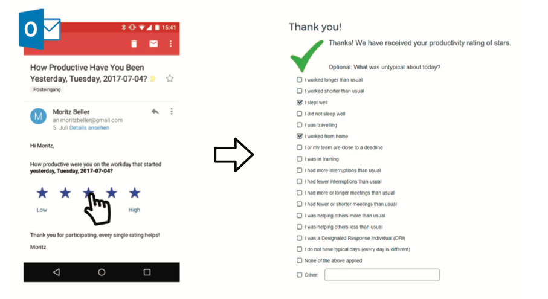
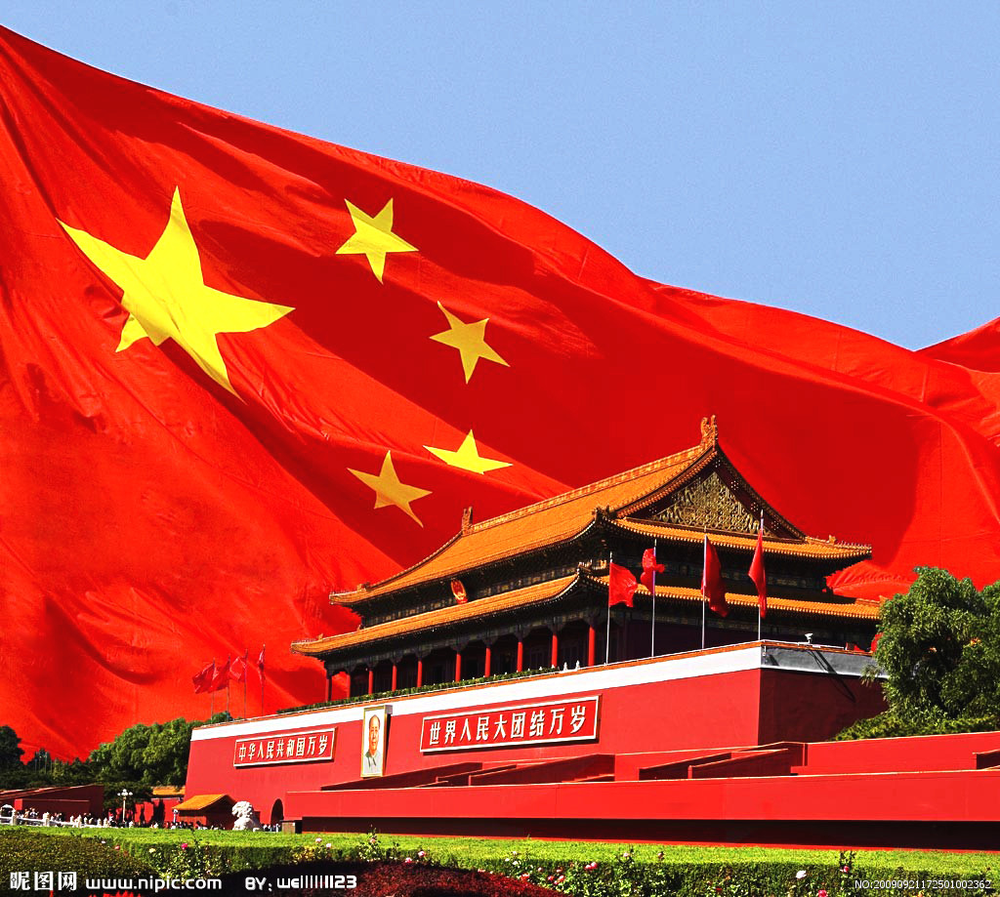

* content
{:toc}

软件工程会议中的演讲稿

## 引言

前段时间，丛斌老师分享了微软公司关于软件效率的一项调查，其中的一些调查数据引起了我的思考，在这里我想和大家一起探讨交流一下。

微软文章原文名称为《Mind the Gap: On the Relationship Between Automatically Measured and Self-Reported Productivity》大致内容是这样的：

作者启动了一项调查，从Windows软件开发人员中随机抽取了81个人进行调查，调查分成三种形式

1. 每天的问卷邮件，如图所示，左边是自我评价，右边是影响因素的选择
2. 采用了微软内部的一个APP对当前活动窗体进行记录，并对记录数据进行分析
3. 收集其他数据，包括版本管理工具的信息、代码分析工具的信息、outlook中的会议信息和日程安排信息等。

调查持续了5周，收集了1479份问卷。作者把最终的数据通过线性回归的方法与最终的生产率数据进行了比对，最终生成对开发效率的影响因子如下：

里边有几个数据是很有价值的：

1. 生产率和编码时间高度正相关，编码时间越长，生产率越高。这似乎论证了996和加班的科学性。但是这一点与本次议题无关，所以我们忽略。
2. 良好的睡眠能极大的提升生产率。
3. 随时待命状态（比如出差，居家工作）会极大的降低生产率，因为他们处于被打扰的状态，减少各种琐事的打扰能极大的提高生产率，而增加各种琐事的打扰的次数会明显降低生产率。

## 琐事的危害

结合我们自己的生活，我想各位都有很深的体会。就拿我自己来说，在单位就会受到各种打扰。我属于进入状态比较慢，但是进入心流状态以后效率就会很高的那种人，所以特别怕别人打扰我的思路，因为一旦被打扰，就需要很长时间才能再次进去到高效学习工作的状态。因此在单位的正常工作时间很难高校的学习工作。而在家就更别提了，对于我这种中年男的二胎家庭，回到家就面临着“爸爸，来给我讲故事”，“爸爸，给我作业签字”，“赵星汉，孩要拉臭臭”等等等等，懂得都懂。所以我总觉得只有在下班后没人的办公室里，停车场一个人呆在车里，晚上十一点以后自己一个人呆在书房里，我才能找回我自己。究其原因，就是因为琐事。

琐事的认知，是和人所处的位置相关。比如对于我来说，管理孩子就是琐事，各种管理会议也是琐事，这都会给我造成很大的困扰，给我造成头疼、心烦、胸闷等不良症状。但是对于某些女同志来说，可能就不是琐事，和孩子互动能让他们心情愉悦，比如我妈。同样的，回到软件工程中，一些在我们搞质量的人员眼里，不是琐事的事情，比如日报、MA等活动，不应该是琐事，但是在一线编码人员眼里，可能就是琐事，因为这些活动不能对他们产生直接价值。

让我们回到软件工程中来，根据我们前边的讨论，琐事对于软件开发的负面作用是十分明显的，体现在如下几个方面：

1. 开发期间各种琐事明显会降低开发效率。
2. 即使我们一些管理型事物的出发点是提高软件质量，但如果处理不当，其实际效果未必达到预期。
3. 员工心中的各种琐事会降低员工的成就感与整体满意度，造成队伍士气下降，甚至核心人员离职。

## 敏捷，就是减少琐事，CMMI也要减少琐事

CMMI1.2到1.3，再到2.0的改版，最重要的就是敏捷方面的加强。那么问题来了，到底什么是敏捷？

在我的认知中，敏捷不是一个名词，不是说我们采用了看板和燃尽图就是敏捷了，不是说我们把人召集在一起工作，每天开个站会就是敏捷了……在我的认知中，敏捷是一个形容词，如果采用了一个新的开发形式或方法，让我们的产出比更高了，换句话说，就是琐事更少了，那么这个方法就是敏捷的，它不一定包含在现在的各种敏捷流派中，但一定是符合敏捷宣言精神的。

前段时间，我参加了一个高校为主的软件工程学术会议，参会的都是各大高校的老师和博士。参会的过程给我一个直观的感受，各位学者在研究如何让我们科学的偷懒方面真的操碎了心，甚至有很多学者在研究如何自动生成版本提交的注释之类的问题，当我听到第三位如何让代码自动生成配置管理提交的信息时，我再也忍不住了，这也太能偷懒了，就简单写一行版本注释有什么难的呢，我觉得我作为CMMI和5000的从业者，不能助长这种歪风邪气。于是我就发言说这种方法在实际工程中根本不适用，研究这类问题意义不大。当时会场一片哗然，那些老师都懵了，他们哪里听到过这些啊。之后他们的会议就不让我去了……

开个玩笑哈，总的来说，当下最前沿的软件工程，其核心就是研究如何减少琐事，让整个研发过程更加高效，所以我们在实际项目中做软件工程管理的，在规划各类管理活动中可千万要注意，我们大笔一挥增加一个管理活动，就可能会抵消了几十个教授的智慧结晶了。

在我的观念里，当下软件工程的前沿热点，就集中在如下几个方面：

更高、更快、更强。

图没放错，和奥运一样。

- 所谓更高，这里指的是有大量的高新技术应用到了软件工程中，比如CAN生成测试样本，用大数据辅助测试资源分配等。
- 所谓更快，这里指的是软件研发的进度越来越快，这归结于自动化和一体化流程在不断的扩展，比如我们从一开始的纯手动，到后来的CI，到后来的DevOps，再到如今的DevSecOps，越来越多的自动化和一体化引入使得研发过程越来越快，研发各部分的界面越来越模糊。
- 所谓更强，这里指的是研发的质量在不断提升，特别是在以前一直在用敏捷开发的互联网企业中，我们搞CMMI和5000的，在逐渐拥抱敏捷，而那些传统的敏捷开发企业，其实也在逐渐的CMMI化。得益于更多质量控制环节的自动化，传统的互联网企业正在把很多CMMI的优秀实践运用到开发中，使得程序质量得到了极大的提高。CMMI和敏捷，正在齐头并进的过程中逐渐汇合。

## 那么，我们应该如何做？

1. 梳理我们如今的软件管理过程，看看是否每一项管理活动都是可以达到预期的，都是收益高于成本的，如果不是，是否可以删掉。
2. 以EPG的名义向管理层反映，在软件开发的过程中，尽量减少外来因素的干扰，将某一个时间段内的任务单一化，从而提高效率。
3. 将能自动化的任务自动化，能自动化的流程也要自动化，这是如今发展的大趋势。在这里特别想说的是度量。度量是最应该自动化的，几乎所有的SE论文中都说明了人工上报的不可取。关于度量，我向大家推荐一本很不错的参考书《软件度量的最佳实践（中译本）》，这本书中对度量的理论和实践讲解的都十分清楚，最重要的是，这本书是于智勇老师、王莉老师、左振雷老师和我联合翻译的，欢迎大家批评讨论。
4. 要利用正确的价值观加以引导。对于一个开发个体，任何不符合他的价值观的事情，其实都是琐事，哪怕这件事很有意义，而符合价值观的事情，都不是琐事，因为他能找到做这件事的意义并获得成就感。在各种价值观碰撞的当下，我们的很多工作不能向那些互联网企业那样拿到很高的收入，也不能向很多明星和各类大V那样，用各种方式捧红自己，那么，我们工作的意义何在，没有意义那就是琐事，还谈什么开发效率？我们的意义在于，虽然我们的工作收入不高，也无法捧红自己，但我们却捧红了他，这就是我们做事情的意义所在。

