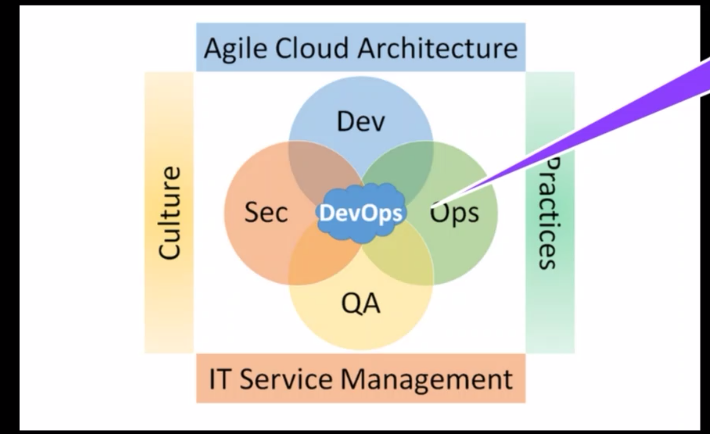

* content
{:toc}

IBM校企联合课程笔记（一）

ITOps为什么重要？

如何确定哪些数字是我们需要的？哪些是应该排在前边？

Troy：简单来说，数据的排序，以及如何做出决策，无比重要。所以，很多的企业里面，需要有CIO 来做数字化的工作，甚至于很多企业现在有 CDO chief digital officer，来专门处理这部分业务。具体哪些是需要的，以及多维度数据的重要性排序等等，通常是以 CIO/CDO 带队的数字化团队来完成。 至于具体的操作层面，一般来说，是由业务团队，或者外聘咨询团队来提供咨询服务辅助决策。

IBM的开发过程

右边的四个方向是DevOps执行的重点和特点

AIOps是ITOps的自然演变，是应用人工智能来增强IT运营，包括事件关联，异常检测和因果关系确定。

IT运维智能化转型的十二步：

chatOps

safeMod是IBM的敏捷开发方式

