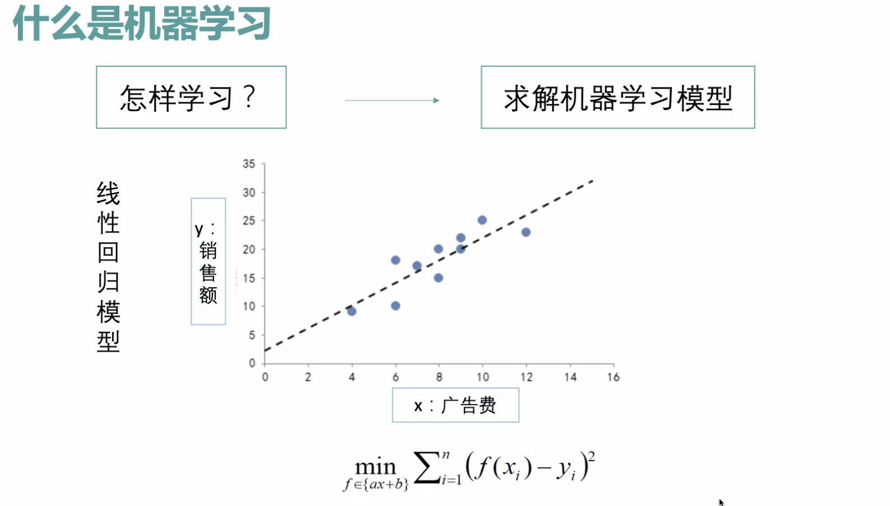

* content
{:toc}

机器学习在行业中的应用

## 什么是机器学习

要学什么？ --》决策函数

x ->F(x) -> y 

从哪里学？ --》 训练数据

怎么学  --> 求解模型

## 机器学习三要素

使用经验数据，针对某个目标，提高学习性能

## 机器学习的问题

回归、分类、聚类、降维

监督学习、无监督学习、半监督学习、强化学习

## 过程

数据收集 数据清洗 特征工程 数据建模

## 下边不想记了

