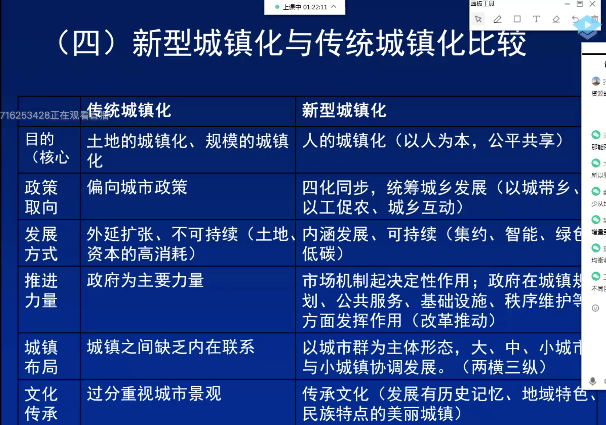
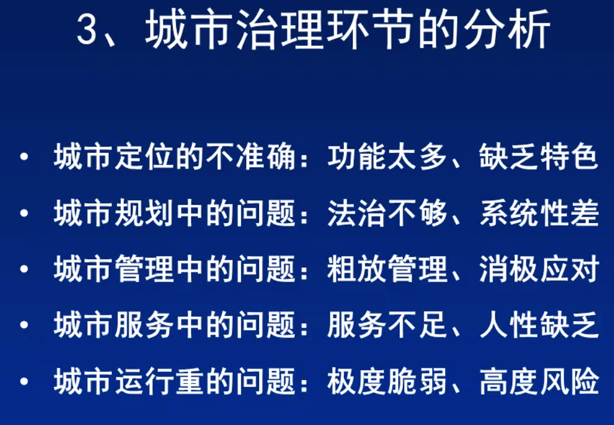

* content
{:toc}

中国的城镇化道理认识与探索

## 城镇化

城镇化的本质是人口向城镇化的转移。

1. 人口城镇化
2. 景观的城镇化
3. 功能的城镇化

现代农业是城镇化的基础。

政府政策影响城镇化。

城乡统筹，城乡一体，产城互动，节约集约，生态宜居，和谐发展为基本特征的城镇化。

新型城镇化，是以人为核心的城镇化。

以人为本，四化同步，优化布局，生态文明，传承文化的新城镇化道路。

2020年，我国城镇化率已经突破了60%。

1. 片面注重城市规模扩张
2. 区域发展不平衡
3. 城镇规模和层次发展不协调
4. 城乡二元结构缓慢城镇化发展的进程

以物为本到以人为本，

### 我国天津新型城镇化分析：
天津华明示范镇新型城镇化作为我国唯一的农村城市化示范成功参展上海世博会最佳实践区的天津华明示范镇在新型城镇化方面走出了一条极具特色的城镇化道路。

#### 宅基地换房

2006年，华明示范区成为“宅基地换房”的试点。

原则：坚持承包责任制，不减少可耕种土地农民自愿换取城镇中的新楼房同时原油宅基地复垦。

发展态势：新型小城镇，实现人口向城镇转移，工业向园区转移，同时土地集中。

优越性：有更多空间和力量集中建设，城乡一体化发展，减少城乡居民收入差距。

#### 三区联动

农民居住进社区、工业生产进园区、农业生产在园区。

优越性：三区互动、共同发展。

#### 三改一化

集改股、股改非、村改居，推进城乡一体化。

具体实施办法：

1. 经济组织改革
2. 户籍改革
3. 村改居
4. 城乡一体化

#### 创新思维

1. 社会管理创新
2. 金融创新

## 课后感想

我对今天的内容比较感兴趣，因为农村人口占我国的大部分，而且我喜欢去农村玩，媳妇家也是郊区的，所以我对农村的变化还是比较清楚的。当然，肯定比较片面，因为主要集中在郑州的周边。

农村的改革，在上世纪九十年代以后变得加速了很多。我记得郑州的三环外，以前都是农田，现在过去全是市区的楼房，以前摘野菜的地方，现在是二七区的中心位置——二七万达。我们单位以前的位置，在15年前还是圃田乡，妥妥的农村，现在是市里房价最高的地方。我媳妇家是郑州西郊那边马寨乡的，以前就是农村，但是那边现在有好多大学，也已经完全的城镇化了。

但是，我们也应该看到城镇化存在的问题，比如现在很多农村大搞城镇化，建的厂房和工业园都没有人去，农村土地回收后，其收益并没有被反馈到原农民，被贪墨或以其他形式流失掉了。还有一个重要的问题，我觉得老师没有讲到，就是原来的农民变成了市民，但是其思想，还停留在原来农民的层次，在自身素质和法律观念等还没有城镇化。

不过，就像我课上的发言，我们城镇化的大方向上，还是越来越好的。