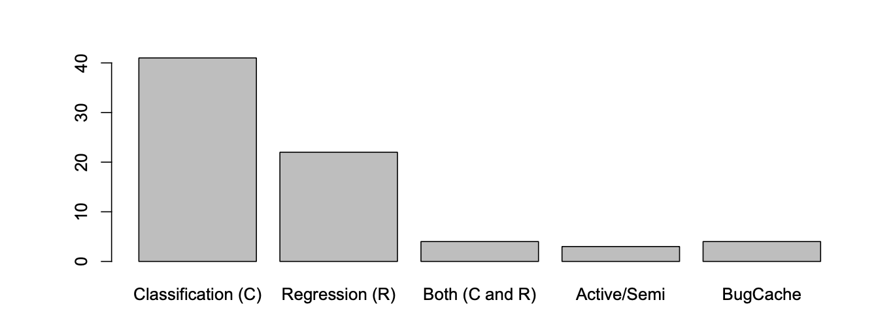
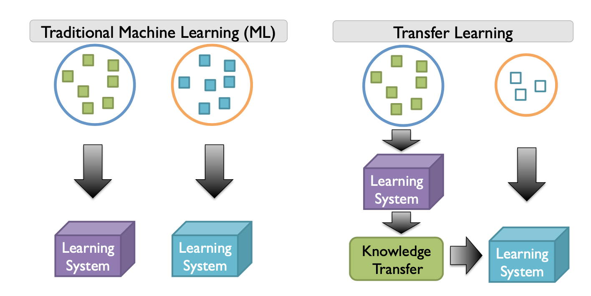

* content
{:toc}

软件缺陷预测的一些研究记录

## 缺陷预测的模型

缺陷预测的步骤主要分成以下几步：

1. 从一个software archives里生成许多实例。实例中有一些指标，这些指标反映了一些特性，如存在BUG或者不存在BUG等。
2. 应用预处理，一般包括挑选需要的特征，数据归一化，减少噪声等步骤。预处理步骤是可选的，按照需要看是否需要预处理。
3. 应用机器学习，根据预处理的数据形成合适的模型。
4. 根据需要进行回归或者分类。

## 缺陷预测的主要历史

最开始的缺陷预测开始于1971年，Akiyama利用一个简单的指标——代码行进行缺陷预测，因为代码行可以表征系统的复杂度，代码行越大，一般而言复杂度越高。但是，代码行作为唯一的参数进行预测，实在是过于简单了。在1976和1977年，MaCabe和Halstead主张利用圈复杂度进行预测，这一指标在70年代和80年代初期非常流行。

虽然这些指标在一定程度上解决了预测的问题，但是这些研究其实仅仅是实现了指标和缺陷数量的拟合，只能代表指标和缺陷的相关性，其实并不是预测模型。为了解决这些研究的局限性，Shen等人利用线性回归模型在新的程序模块中进行了尝试。但是Muson等人批评这种流行的回归技术并不严格，并提出了一种新的分类模型，将模块分成高危和低危两个类别。这种分类技术在他们的目标模块中取得了92%的准确性。但是，Munson等人的研究还是具有一定的局限性，比如他们并没有解决面向对象系统的指标问题，也没有利用开发过程中的一些特性指标。

关于面向对象的系统，Chidamber和kemerer在1994年提出了一些OO系统的指标，Basili等人在OO系统中进行了应用。上世纪90年代，版本控制系统逐渐变得流行，开发过程信息在2000年后逐渐集成到了预测指标中。

## 缺陷预测的限制

### 实时性问题

在2000年代，缺陷预测存在一些限制。第一个限制是预测模型可以在产品发布之前用于质量保证。但是，如果我们能够在更改源代码时预测缺陷，那将更有帮助。为了实现这一目标，Mockus等人提出了一个缺陷预测模型。最近，这种模型被称为实时（JIT）缺陷预测模型。近年来，其他研究人员已经研究了JIT预测模型。

### 缺乏历史数据的问题

第二个限制是我们很难对一个纯新的，或者是历史数据匮乏的程序进行预测。为了解决这一问题，学者们也研究出了很多的跨工程的预测模型，在跨项目缺陷预测中，识别交叉预测是另一个问题，因此Zimmermann等人和He等人进行了交叉预测可行性研究。

### 有效性问题

“缺陷预测到底对实际的工业帮助多大”，关于这个问题，也有很多学者根据具体案例进行了一系列的研究。

## 缺陷预测的指标

### 指标类别

主要分成两类，源代码指标和过程指标。

源代码指标用来衡量源代码的复杂度，源代码越复杂，则越容易出错。

过程指标从软件档案得来，一般来源于版本控制工具。过程指标一般对于开发过程的多个方面进行量化，比如源代码的更改，源代码的所有权，开发人员的互动等方面。

### 典型的指标

#### 项目中/跨项目

指标：代码行，流程，变更，熵，所有权，作者身份，MIM，网络测量，反模式

算法/模型：分类、回归、主动/半监督学习、BugCache。

更精细的预测粒度：变更分类、方法分层预测

预处理：特性选择/采集，归一化，噪声处理

#### 跨项目

转换学习：度量补偿、NN滤波、TNB、TCA+

可行性：决策树

### BTW

一些学者确信跨项目的预测是很难实现的。

## 评价度量

### 分类的度量指标

True positive(TP): 错误的实例预测为错误  
False positive(FP): 正确的实例预测为错误  
True negative(TN): 正确的实例预测为正确
False negative(FN): 错误的实例预测为正确

### 常见的指标计算方法

#### False positive rate（FPR）:

$$ \frac{FP}{TN+FP}$$

#### Accuracy：

$$\frac{TP+TN}{TP+FP+TN+FN}$$

#### Precision

$$ \frac{TP}{TP+FP}$$

#### Recall

$$ \frac{TP}{TP+FN}$$

#### F-measure

$$\frac{2\times(Precision\times Recall)}{Precison+ Recall}$$

## 缺陷预测指标

### 代码指标

代码指标主要用于恒量代码的复杂度。它也是基于一个假设：复杂的代码更可能有更多的BUG。

#### Size

最简单也是最早的方法，主要用于恒量代码行，表征的是产品的规模。

#### Halstead

提出了若干表征规模的指标，主要基于操作和运算单元的数量。它所提出的指标包括程序词汇表、长度、卷、难度、效能和时间。

#### McCabe

提出了用环形指标来表示软件的复杂度。环形指标通过控制流图中的节点、弧和连接部件的数量来计算。

#### CK

主要用于面向对象。常用的有WMC，DIT，NOC，CBO，RFC，LCOM等。

### 流程指标

1）相关代码变更改动：通过增删改代码行的数量与代码总量的比值来定义一系列的变更表征数据。

2）变更指标：通过在版本控制系统中测量变更范围

3）变更熵：应用香农熵来获取变更的复杂程度，并提供历史复杂度指标。

4）代码指标变动，代码熵：每两周计算一次，算法挺复杂的，没看懂，与3不太一样。

5）受欢迎程度：它基于的原理是邮件中讨论的越多的软件，其BUG也就越多，它由此定义了一系列的指标。

6）著作权和所有权：基于原理是软件的作者能力越高BUG越少，并由此定义了一系列的指标。

7）微互动指标：来源于一个事实，即软件BUG是由开发人员的错误引起的。例如，一个文件修改的时间越长，那么这个文件就越可能出错。作者通过Eclipse插件拿到数据，并定义了一系列的指标。

## 缺陷预测模型

大部分模型都是基于机器学习的，主要分成两个大类：分类和回归。当新的机器学习技术得到进展，半监督学习和主动学习也为预测模型提供了更大的帮助。除此之外，非统计类的模型，比如BugCache也被提出。

从研究的热度来看，分类和回归是最主流的预测模型方式，其中分类的目的是找出那些软件模块更容易有bug，而回归的目的是预测出模块中可能的缺陷的数量。具体使用哪种方式，应该由研究的目的来确定。

关于机器学习的算法，逻辑回归是最常用的，朴素贝叶斯和决策树也是非常常见的。回归模型的机器学习器而言，线性回归和负二项式回归在文献中已被广泛使用。

## 缺陷预测的粒度

缺陷预测有很多种粒度，比如子系统、部件、包、文件、类、方法，以及变更。因为不同的组织有各自的管理形式，应该根据质量保证中的需求来采用不同的粒度。

Kim的文章中涉及到了一种叫做更改分类的模型。与常规的模型不同，它的模型在设计人员发生更改后，能够即时的提出一个预测结果。但是这个模型太重，很难在实践中使用，因为这个模型有一万多个参数。

## 缺陷数据集的预处理

### 归一化

归一化（Normalization）是将不同的指标设置成相同的权重，从而改进分类模型的性能。

Menzies团队建议使用log-filter来对指数分布的指标进行归一化。Nam等人观察到，交叉预测性能因不同的归一化技术而异。Nam等人定义了选择适当归一化技术的规则，例如最小-最大归一化，z分数和z分数的变化，以提高交叉预测的性能。

### 参数的选用

Shivaji的团队指出预测模型的性能不佳，很大程度上是因为模型的参数选择的不对，并且他提出了一个可以改进分类性能的技术。Turban也使用了一个跨公司缺陷预测前采用信息反馈参数子集的方式构建模型的技术。由于缺陷预测数据集可能存在多重共线性问题，研究人员应用主成分分析（PCA）提取预测模型的新特征。

### 减小噪音

因为预测的数据都是来源于版本控制系统的各种信息，根据Bird等人的研究，其可能存在偏差。Wu提出了Relink的方法来自动化的处理commit log和问题ID之间的关系，Kim也提出了CLNI的方法。

## 跨项目缺陷预测

我们都想要预测模型具有普遍适应性。但是事实上如果一个模型具有普遍适应性，它需要建立在一个前提上，就是被预测的项目的缺陷分布和模型所学习的项目的缺陷分布是一致的。Zimmermann的研究中，622个跨项目的预测中，只有千分之34的预测是有效的。为了解决这一问题，学术界将目光集中到了迁移学习上。

具体涉及的技术有：公制补偿（Metric compensation），NN Filter，TNB，TCA+。

## 缺陷预测的应用

缺陷预测一个最主要的目的就是指导预测和测试的资源分配，然而，工业界采用的却很少，所以很多研究都比较关注费效比。最近的一项研究是谷歌公司的Lewis做的，他通过很多关闭的缺陷比较了BugCache和Rahman的方法，发现开发人员更喜欢rahman的方法。但是，开发人员仍然表示并没有从预测模型中得到明显的好处。

rahman的一个近期研究表明缺陷预测对于静态分析中对警告信息进行排序非常有用。

另一个可能的应用是我们可以利用缺陷预测的结果对测试用例进行排序选用。在回归测试中，重新对所有的测试用例都执行一遍的花费是巨大的，但是我们可以利用预测的结果对选用测试用例。

## 缺陷预测的其他主题

### 缺陷预测的隐私

软件缺陷需要大量的数据来进行学习，但是软件公司不愿意分享他们的缺陷数据集，因为"敏感属性值披露"。为了解决这个问题，MORPH通过保持类决策边界来随机移动实例。通过这种方式，MORPH可以私有化原始数据集，并且仍然可以实现良好的预测性能，就像原始缺陷数据集训练的模型一样。

### 缺陷预测模型与static bug finder的比较

Rahman认为二者可以互相促进。一是他们可以找到不一样的缺陷；二是缺陷预测模型可以将static bug finder的警告信息进行优先级排序。

## 当前研究的不足

1. 大多数都是基于开源软件，对商业软件的适配性有待考察。
2. 跨项目的预测还存在很大的问题，一是影响因子有差异，二是可行性研究还有待成熟。
3. 软件工程越来越大，文件等级的缺陷预测在费效比方面已经不太合算，然而在更精细层面的预测的研究却还是很稀缺。业内需要例如代码行层面的和改动分类等类似的更精细的预测研究。
4. 到目前为止，提出的缺陷预测指标和模型可能并不总是保证通常良好的预测性能。然而随着软件工程的进展，我们可以不断的提取出新的指标，而这些指标可能蕴含着更好的预测性能。

