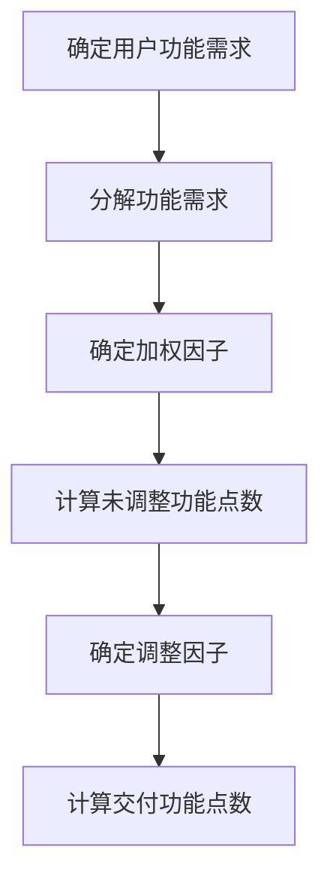

* content
{:toc}

再次学习GJB8000的功能点计算方法，将笔记记一下

-----

## 什么是功能点估算方法

功能点估算方法是从用户角度来估算软件规模，是基于客观的外部应用接口和主观的内部应用复杂度以及总体的系统性能特征，对软件功能规模进行间接定量估算。

GJB8000的功能点是通过IFPUG功能点估算方法进行估计的。

-----

## 功能点估算步骤

1. 确定用户功能需求
2. 分解功能需求
3. 确定加权因子
4. 计算未调整功能点数
5. 确定调整因子
6. 计算交付功能点数

流程图如下：

-----

## 具体的实施细节

### 确定用户功能需求

这里的用户功能需求不包括质量需求和软件开发和维护等过程的技术以及环境需求。

###  分解功能需求

按照下表的功能单元类型进行分解，尽量分解到最小的功能单元。

| 数据功能 | 事物功能 |
|-|-|
|内部逻辑文件 外部接口文件| 外部输入   外部输出   外部查询   |

- **内部逻辑文件（ILF）**：用户可确认的一组在软件内部维护的逻辑相关的数据或控制信息。内部逻辑文件的主要用途是通过本软件的一个或者更多的基本过程来控制数据。
- **外部接口文件（EIF）**：用户可确认的一组由本软件引用但有其他软件维护的逻辑相关的数据或者控制信息。外部接口文件的主要用途是通过本软件的一个或者更多的基本过程来控制数据引用，即一个软件的外部接口文件应是另一个软件的内部逻辑文件。
- **外部输入（EI）**：一个对来自本软件边界意外的数据或者控制信息进行处理的基本过程。外部输入的主要用途是维护一个或更多的内部逻辑文件和（或）改变系统的行为。
- **外部输出（EO）**：一个向本软件边界外发送数据或控制信息的基本过程。外部输出的主要用途是通过处理逻辑或者通过数据或控制信息的检索给用户提供信息。该处理过程应至少包含一个数学公式或者计算，产生到处数据，维护一个或多个内部逻辑文件，或改变系统行为。
- **外部查询（EQ）**：一个向本软件边界外发送数据或控制信息的基本过程。外部查询的主要用途是通过外部接口文件中的内部逻辑文件进行数据或者控制信息的检索，给用户提供信息。这一处理逻辑不包含数学公式或计算，不产生导出数据，该过程既不维护内部逻辑文件也不改变系统行为。

### 确定加权因子

功能赴澳洲读按照高、平均或低进行划分。它由某一功能单元涉及的数据元素类型数和记录元素类型数或引用文件类型数共同决定。

**数据元素类型数（DET）**：唯一的、用户可识别的、非重复的字段
**记录元素类型（RET）**：用户可识别的内部逻辑文件或者外部接口文件中的一个数据元素子集；
**引用文件类型（FTR）**：被处理事物所读写或读取的文件，应是内部逻辑文件或者外部接口文件。

#### ILF与EIF的复杂度矩阵对应表

| 记录元素类型数 | 数据元素类型数(1-19)|(20-50)|(>51) |
| - | -| -|-|-|
|1 | 低| 低 |平均 |
|2-5 | 低 |平均 | 高 |
|大于6 | 平均|  高| 高 |

#### EO的复杂度矩阵对应表

|引用文件类型数|  数据元素类型数  1-5   |  6-19   | >20 |
|-|-|-|-|
|0-1 |低 | 低  |平均|
|2-3 |低  |平均  |  高|
|大于等于4  | 平均   | 高  | 高   |

#### EI的复杂度矩阵对应表

|引用文件类型数|  数据元素类型数  1-4 | 5-15  | >16 |
|-|-|-|-|
|0-1 |低 | 低  |平均|
|2 |低  |平均  |  高|
|大于等于3 | 平均   | 高  | 高   |

#### EQ的复杂度矩阵对应表

|引用文件类型数|  数据元素类型数  1-5   |  6-19   | >20 |
|-|-|-|-|
|0-1 |低 | 低  |平均|
|2-3 |低  |平均  |  高|
|大于等于4  | 平均   | 高  | 高   |

根据功能单元的复杂度属于高、平均、或者低，按照加权因子对应表确定各功能单元的加权因子。

#### 加权因子对应表

| 功能单元类型| 功能复杂度 低 | 平均 |高|
|-|-|-|-|
|内部逻辑文件| 7 | 10| 15|
|外部接口文件| 5 |7|10|
|外部输入|3|4|6|
|外部输出|4|5|7|
|外部查询|3|4|6|

### 计算未调整功能点数

分别将外部输入（EI）、外部输出（EO）、外部查询（EQ），内部逻辑文件（ILF）以及外部接口文件（EIF）的个数和与之对应的加权因子相乘，然后再把各乘积加在一起，其结果即为未调整功能点数（UFP）。

$$ UFP= N_{EI} * \theta_{EI}+ N_{EO} * \theta_{EO}+ N_{EQ} * \theta_{EQ} \dots $$

其中，$N$是个数，$\theta$是加权因子

### 确定调整因子

#### 通用系统特征

通用系统特征包括但不限于以下14个方面：

1. 数据通信
2. 分布式数据处理
3. 性能
4. 系统配置要求
5. 事物率
6. 在线数据输入
7. 最终用户效率
8. 在线更新
9. 复杂处理
10. 可重用性
11. 易安装性
12. 易操作性
13. 多工作场所
14. 易变更性

#### 系统特征影响度

每个系统特征影响度取值范围0到5，其中0表示未出现影响或无影响，5表示强影响。

#### 调整因子计算公式

将所有系统特征影响度相加获得总影响程度，调整因子VAF的计算公式如下

$$ VAF = 0.65 + (\sum^n_{i=1}N_i/100)$$

式中，n是根据实际影响确定的系统性能特征个数（不限于14个），N是第i个影响因素的影响程度。

### 计算功能点数

将未调整的功能点数（UFP）和调整因子（VAF）相乘饿到功能点数

$$ FP = UFP * VAF $$

## 估算方法示例

GJB8000里还有一个例子，讲的也很好，有兴趣的可以去看看。我不想再敲了。
