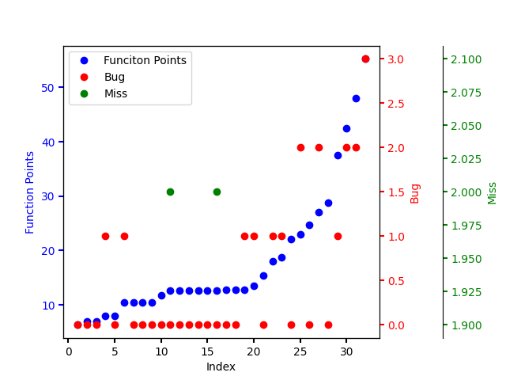

* content
{:toc}


在一张图上多个纵坐标轴


这两天写论文，需要将三个属性连接到一个序列上，想了用面积表达第二，颜色表达第三个属性，又尝试了用三维图，发现效果都不好，今天早上被一只蚊子弄的睡不着了，忽然想到干嘛不用单横坐标多纵坐标的形式解决呢。于是起来查阅相关文档完成了这一方面的内容，记录如下：


直接上代码吧。


```python
from typing import Any
import matplotlib.pyplot as plt 
import numpy as np
import math
import pandas as pd
import seaborn as sns
 


df = pd.read_csv('p1fpa.csv')

sorted_df = df.sort_values(by='fps')

len = len(df)+1

sorted_df['no']= range(1,len)

# print(sorted_df)

fig,ax = plt.subplots()
fig.subplots_adjust(right=0.75)

twin1 = ax.twinx()
twin2 = ax.twinx()

# Offset the right spine of twin2.  The ticks and label have already been
# placed on the right by twinx above.
twin2.spines.right.set_position(("axes", 1.2))

p1, = ax.plot(sorted_df['no'], sorted_df['fps'], "bo", label="Funciton Points")
p2, = twin1.plot(sorted_df['no'], sorted_df['bug'], "ro", label="Bug")
p3, = twin2.plot(sorted_df['no'] ,sorted_df['miss'], "go", label="Miss")

"""
ax.set_xlim(0, 2)
ax.set_ylim(0, 2)
twin1.set_ylim(0, 4)
twin2.set_ylim(1, 65)
"""
ax.set_xlabel("Index")
ax.set_ylabel("Function Points")
twin1.set_ylabel("Bug")
twin2.set_ylabel("Miss")

ax.yaxis.label.set_color(p1.get_color())
twin1.yaxis.label.set_color(p2.get_color())
twin2.yaxis.label.set_color(p3.get_color())

tkw = dict(size=4, width=1.5)
ax.tick_params(axis='y', colors=p1.get_color(), **tkw)
twin1.tick_params(axis='y', colors=p2.get_color(), **tkw)
twin2.tick_params(axis='y', colors=p3.get_color(), **tkw)
ax.tick_params(axis='x', **tkw)

ax.legend(handles=[p1, p2, p3])

plt.show()


```

最终效果如下：

