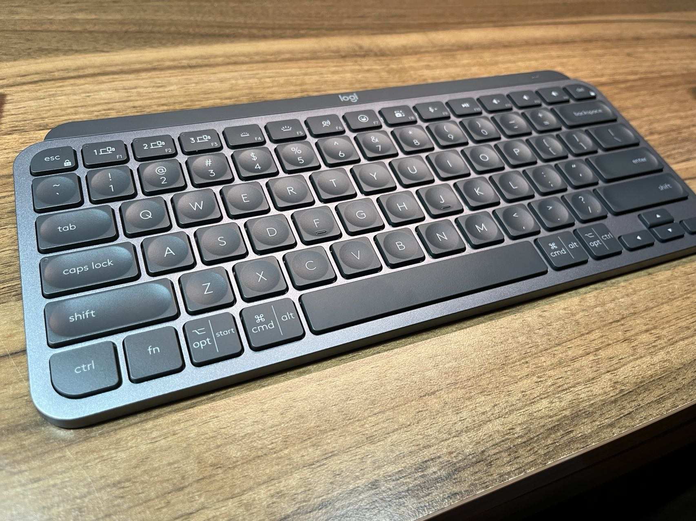
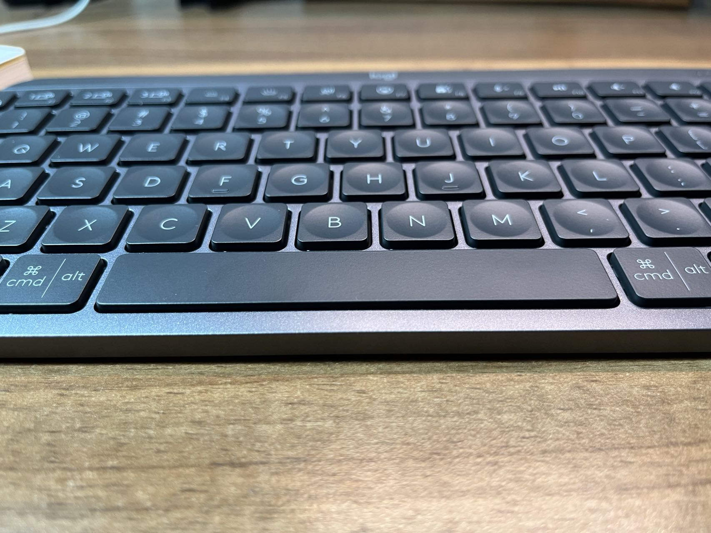
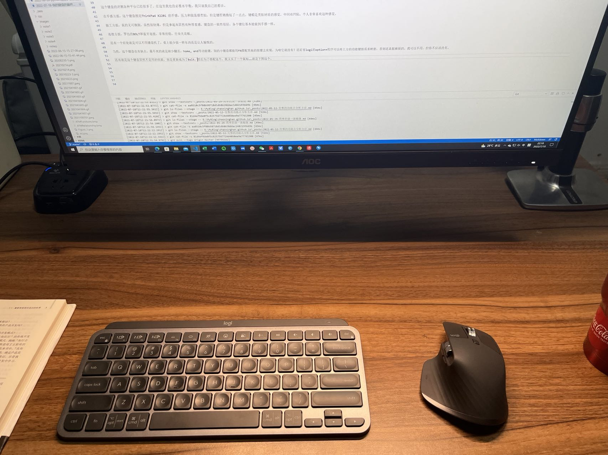

* content
{:toc}

一切重新归于平凡。

## 键盘，一个不算是爱好的爱好

人至中年，虽然我认为自己的心态还算年轻，但是能让自己高兴的事情，其实越来越少。作为一个科研人员，不抽烟，基本不喝酒，下班就回家，除了照顾孩子就是读读书，研究下别人的成果，写写报告和论文，开开会，刷刷视频和朋友圈。生活越来越平淡，老同学和朋友也都有各自的家庭，联系也越来越少，跟自己独处的时间也越来越多。以前还玩玩云顶，现在连云顶也不玩了。对我来说，上班和下班其实区别不大，只是换个地方继续干那些事。如果算起陪伴时间的话，键盘和鼠标，可以说是陪伴我时间最长的两个物件了。

我对键盘是比较挑剔的，手感差或者做工差的肯定是不会去用的。目前用过的印象比较深的，除了陪伴时间最长的ThinkPad系列的T61，X200，X220i上的键盘，使用时间较长的有Cherry的全键盘青轴（型号忘了），Filco的Minila黑轴，红轴，Minila-R茶轴，苹果的magic keyborad2，别人借我玩的铝坨坨套件，腹灵套件，搭配过G银Pro，金粉，自己买的HHKB professional2, 朋友的Niz等。总的来说，各有各的特点。别说这些键鼠贵，哪怕不考虑效率提升，这些东西的总价也不超过喜欢抽烟喝酒的朋友的这些年的烟酒钱。

我对键鼠有几个要求：

1. 稳定可靠
2. 做工要好，要有质感
3. 摆桌子上要好看，好看让我心情好
4. 背光无所谓，但不要RGB

说起来，我算是阅尽千帆，最终归于平凡，机械和静电容用了一个遍，最终的选择居然是回归薄膜键盘。

## 我现在使用的键盘

我得承认，机械键盘的敲击感其实真的挺好。很多人比较反感大F里的弹簧音，但我还是挺喜欢那种金属的颤音的。但是，机械键盘的长键程，对于以前经常用ThinkPad，现在经常使用MacBook Pro的我来说有点难受。我也一直想要一款做工优良，敲击感不错，同时键程还短一些的键盘。

当我看到罗技推出的MX KEYS MINI时，我真的一眼就相中了，低调中透漏出的那种科技感，真的是我喜欢的类型。我不喜欢大键盘，数字键盘我基本不用，所以这个mini正好是我的菜。

这个键盘的评测各种平台已经很多了，在这里我也没必要水字数。我只说我自己的看法。

在手感方面，这个键盘接近ThinkPad X220i 的手感，压力和段落感类似，但是键程稍微短了一点点，键帽是类肤材质的感觉，中间有凹陷，个人非常喜欢这种感觉。

做工方面，真的无可挑剔，虽然很轻薄，但是拿起来居然有种厚重感，键盘的一致性很好，各个键位基本能做到手感一样。

连接方面，罗技的BOLT和蓝牙连接，非常的稳，行业天花板。

还有一个好处就是可以不用键盘托了，桌上能少放一样东西还是让人愉悦的。

软件也是不得不说的优势，罗技的Option+，可以指定不同的程序中将功能键映射成不同的功能，真的很方便。还有就是罗技的Flow，对于我这种需要PC和Mac切换的人来说非常有用。

当然，这个键盘也有缺点，最不爽的就是缺少翻页，home, end等功能键，别的小键盘都能用FN搭配其他的按键去实现，为啥它就没有？还好有logi的option+程序可以将上方的功能键按需求映射，否则还真挺麻烦的。我可以不用，但你不应该没有。

还有就是这个键盘居然不是用的优联，而是更新成为了Bolt，然后为了搭配这个，我又买了一个鼠标……就是下图这个。

下次有机会再聊聊这款鼠标。

