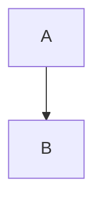

* content
{:toc}

软件产品线笔记，《Software product lines: a case study》

## 什么是FAST

The Family-Oreientied Abstraction, Specification and Translation (FAST) process is an example of a product line development process. With FAST, the common and variable characteristics of a product family are described using a process called commonality analysis.

## FAST的步骤

The FAST process is split into two phases: domain engineering and application engineering. 

- Domain engineering: The domain engineering step represents an investment, where effort is spent understanding how a family of products share common attributes but remain distinct. The understanding is translated into technology, such as a common set of subroutines or a domain-specific language. We call this technology an **Application Engineering Environment**.
- Application engineering: Application engineering uses the Application engneering environment above to produce individual members of the product family. 

