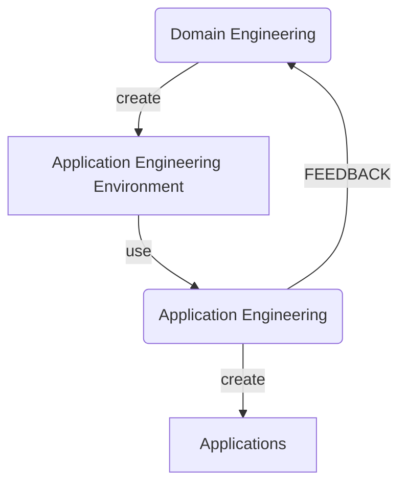

* content
  {:toc}

软件产品线学习笔记

## 什么是FAST

Family-Oriented Abstraction, specification, and Translation (FAST) 是传统软件开发过程的另一种选择，适用于需要针对产品开发多个不同版本的组织，这些不同的版本的软件拥有大量的相同特征，例如通用行为，通用界面，通用代码等。相对于维护这些共性因素的不同版本，FAST在这方面有很大的优势，因为FAST将这些看成一个整体实例。

FAST过程分成两个部分，领域工程（Domain engineering）和应用工程(Application engineering)，领域工程致力于理解产品族（family of product）的通用属性和差异的具体性质。这些分析和理解将被转成某种形式，如通用性子程序集合，或者领域特定的语言。我们将这种转换后的形式叫做应用工程环境（Application engineering environment）。

应用工程使用应用工程环境来产生产品族下属的不同产品。应用工程环境所造成的支出将会产生一个高效的过程，这样产品族下的很多产品将会被又快又好的研制。而使用过程中的反馈会给应用工程环境提供改进建议，这些改进通常会在对原来的领域进行影响分析后进行。

## FAST的效能

领域工程的经济性分析如图所示

如果在使用领域工程后，研发新品所支出的边际成本要小于没有使用领域工程的成本，则领域工程的投资将在生产若干新品后收回并产生盈余。在我们的经验中，边际成本的降低约为原来的四分之一，而初始投资通常小于研发三个新品的支出。

## FAST的步骤

### 领域工程

1. 领域分析

由相关专家收集产品族的相关知识，并形成文档。一个推荐的FAST方法是共性分析（Commonality analysis）。它由一个结构化的交互过程组成，用来列举产品族中的共性和差异部分。在关键领域中，可以采用形式化方法来完成这项工作，但是最常用的还是采用自然语言来描述。文档中还通常会记录领域中的术语，分析工作的范围，以及分析期间发生的问题（及其解决方案）。

在共性分析期间，通常的做法是收集并使用示例场景来探索软件产品之间的差异。在这项工作中，我们会区分对可用性场景（usability scenarios,描述执行常见用户操作所需的操作）和可变性场景（variability scenarios, 强调各个产品之间的差异）。
