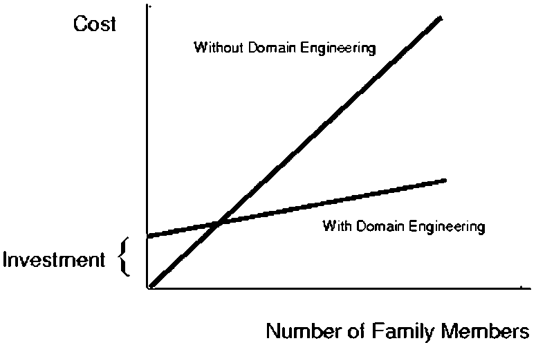

* content
  {:toc}

软件产品线学习笔记

## 什么是FAST

Family-Oriented Abstraction, specification, and Translation (FAST) 是传统软件开发过程的另一种选择，适用于需要针对产品开发多个不同版本的组织，这些不同的版本的软件拥有大量的相同特征，例如通用行为，通用界面，通用代码等。相对于维护这些共性因素的不同版本，FAST在这方面有很大的优势，因为FAST将这些看成一个整体实例。

FAST过程分成两个部分，领域工程（Domain engineering）和应用工程(Application engineering)，领域工程致力于理解产品族（family of product）的通用属性和差异的具体性质。这些分析和理解将被转成某种形式，如通用性子程序集合，或者领域特定的语言。我们将这种转换后的形式叫做应用工程环境（Application engineering environment）。

应用工程使用应用工程环境来产生产品族下属的不同产品。应用工程环境所造成的支出将会产生一个高效的过程，这样产品族下的很多产品将会被又快又好的研制。而使用过程中的反馈会给应用工程环境提供改进建议，这些改进通常会在对原来的领域进行影响分析后进行。

graph TD
    t1(Domain Engineering)--create-->t2[Application Engineering Environment]--use-->t3(Application Engineering)--create-->t4[Applications]
    t3--FEEDBACK-->t1

## FAST的效能

领域工程的经济性分析如图所示

如果在使用领域工程后，研发新品所支出的边际成本要小于没有使用领域工程的成本，则领域工程的投资将在生产若干新品后收回并产生盈余。在我们的经验中，边际成本的降低约为原来的四分之一，而初始投资通常小于研发三个新品的支出。

## FAST的步骤

### 领域工程

领域工程的具体工作分成以下几个步骤：

1. 领域分析

由相关专家收集产品族的相关知识，并形成文档。一个推荐的FAST方法是共性分析（Commonality analysis，具体参见下一小节内容）。它由一个结构化的交互过程组成，用来列举产品族中的共性和差异部分。在关键领域中，可以采用形式化方法来完成这项工作，但是最常用的还是采用自然语言来描述。文档中还通常会记录领域中的术语，分析工作的范围，以及分析期间发生的问题（及其解决方案）。

在共性分析期间，通常的做法是收集并使用示例场景来探索软件产品之间的差异。在这项工作中，我们会区分对可用性场景（usability scenarios,描述执行常见用户操作所需的操作）和可变性场景（variability scenarios, 强调各个产品之间的差异）。

2. 转换领域分析结果使其可用

该步骤常见的做法有两种：创建领域特定语言或者创建可组合的部件。前者是一个小型的语言，可以让用户指定产品族中可变性的具体状态；而后者是一个部件库。当然，第二种方法还需要设计一个总体框架来使用这些部件，并且还需要一个组合器（composer），这样设计师就可以在框架内选择不同的部件来实现特定的功能。

Lucent的交换部分使用了领域工程来提高效率并保持产品的高可靠性。大型系统，如5ESS（RM），是由好多更小的子系统研发的带，这些小系统每一个都提供了各自的优化时机。我们在这些子系统中应用领域工程，这些子系统都有自己各自输入和变更数据的窗体，如产生账单，展示交换机不同部件状态，监视和修正效能状态等。这些工程中很多都采用了创建领域特定语言，通常带有一个符合产品规格的图形界面。经统计，使用领域工程的工作组的生产率提高了三到五倍，生成的代码质量也超过了以前的版本。

### 共性分析

下表是我们在这个工程中的共性分析文档，该文档包含七个部分。前边的部分描述领域的概况，确定主要问题和设计要素。后边的部分通过不同产品的差异探究更多的细节。这些文档由一系列的中等规模的领域专家会议得到。

| 题目             | 主要内容                                                                                                                                                  |
| ---------------- | --------------------------------------------------------------------------------------------------------------------------------------------------------- |
| 总体描述         | 对该领域和与其他领域的关系进行总体描述                                                                                                                    |
| 术语             | 对专用术语进行定义和描述，这里应该对每一个术语的具体含义，以及在产品族中的作用描述清楚                                                                    |
| 共性             | 通过一个结构化的判定集合来确定什么样的产品可以成为一个产品族，通常会划分成处理不同属性种类的子集                                                          |
| 可变性           | 有关产品族中个体差异性的一个结构化的判定集合，也会按照共性那样划分成不同的子集                                                                            |
| 差异性的具体参数 | 一个有关差异性的细化的参数列表， 加入了属性值的范围和每一个的绑定时机（参数在开发过程的哪一个阶段可以确定，通常为领域分析时、应用工程时、编译时、运行时） |
| 问题             | 重要决策和替代方案的记录，通常形式为问题以及问题的解答                                                                                                    |
| 场景             | 使用共性和差异性描述的例子                                                                                                                                |

场景的描述可以采用如下的形式：

- 状态： 四行，1列，2个行标题，3个列标题，窗口开始于第一列最后一行，鼠标在表格中心
- 参数值：卷动差值（scroll delta）可以是min,half,max的任意值
- 事件：移除行
- 行为：
  - 当卷动差值为最小，窗口只能往后卷动一行
  - 当卷动差值为一半，窗口可以卷动窗口高度的一半，此时，最后一个新行将下降到窗口的一半
  - 当卷动差值为最大，最后的新增行将降到窗口的底部

需要注意的是，这个例子描述了系统的几种可能的行为。每一个都反映了卷动插值的不同选择。这种场景描述了在产品中不同的差值是如何产生不同的行为的。这对于探索一个特定的光标/窗口的重定位的结果非常有用。

文中举个例子：三个人参加了本项案例的共性分析，他们总共举行了15次会议，大多数2个小时，时间持续了3个月，人工支出90人时。

## 窗体/光标重设的原型

一些主题如果没有图形的辅助是很难讨论的。许多的共性分析文档都包含了框图或其他图形。其中更复杂的概念之一就是改变窗体和光标的事件的序列。例如：当用户删除了一行，此时光标必须移动到新的一行，窗口可能也需要移动。我们将这种行为叫做光标/窗口重设（cursor/window repositioning）。一开始我们手绘了一张图来描述各种可能的顺序。然而我们很快就发现使用原型工具或许是一个更好的方法。于是，我们创建了一个简单的原型来描述可能的顺序。

当这个原型开始运行，它显示提供虚拟值的根窗口。列标题的虚拟值是“CH”，行标题是“RH”，核心是“R”。行和列的字段，如“POINTS”和“LAST NAME”，分别用“RL”和“CL”表示。矩形表示根窗口的显示区域，圆形表示光标的位置。用户可以通过点击鼠标重设光标的位置，或者通过窗体下方的按键来添加或者删除行和列。类似的，通过按键将窗体上下左右移动。

如果某一个动作将光标移出了显示区域，会显示一个错误信息。同样如果显示区域移出了数据边界外也会显示一个错误信息。该原型为每一个操作提供了一个“前”和“后”的图像，所以领域工程师可以看到一个操作是如何表现的。图6的左边展现了当有4行1列的数据，显示窗口在最下方，光标在基础表格核心矩阵中可见值的上边的系统状态。图6的右边的是移除最后一行数据的结果。显示窗口中提示了两个错误信息：窗口在数据之外，以及光标定位在数据之外。

原型是产品族中一个产品的简化版本。它不允许修改表格中的数据，只能允许更改配置的形状。它不会应用任何重定位的策略，但是会手动模拟出这种策略。这种限制使得策略的尝试变得非常容易，同时确保原型不需要因为我们的策略理解的深入而升级。使用这个方式，我们能够尝试若干感兴趣的场景，这些场景涉及到同一产品族下不同产品的差异部分。而做出这样的一个原型其实是微不足道的：一个人在一周内不到20小时就做完了，该产品有19个函数以及550行的人工代码。

## 从特定域语言的生成

在标题表格的产品族中，光标表格重定位的策略是通过首先对共性进行建模，然后创造一种域语言处理可变性来完成的。

### 对重定位策略的建模

该策略我们采用了两个函数：一是窗体重定位另一个是光标重定位，该功能原型依据以下几个方面：

1. 表格形状：对于该策略，基础和窗体表格内容是不相关的，但是表格形状是核心。表格形状是一个四元组：``{numColHdrs, numRowHdrs,numCols,numRows}``。参数 ``numColHdrs``的值在运行时，当行和列添加或删除时会变。参数2和3在对于每一个特定的产品时是固定的，对于例子中的图1，表格的形状是 ``{3,2,2,2}``。
2. 窗体位置：窗体位置是以坐标X，Y的形式保存。
3. 光标位置：光标位置是以{type,X,Y}的形式保存
4. 用户事件：包含了所有鼠标、菜单、快捷键等影响窗体和光标定位的事件。

函数原型为：

nextCursorPosition: $ S \times W \times C \times E -> C $
nextWindowPosition: $  S \times W \times C \times E -> W $

这里S，W，C是所有合法的表格形状，窗体位置和光标位置，E是所有用户事件。

对于窗体的转换，论文中用的是表格描述状态转换，并利用JAVA代码进行辅助描述。个人觉得用UML的状态机，结合文字或者其他形式可能效果会更加直观。

### CWR文档和代码的生成

论文中使用的是InfoWiz语言生成系统来实现领域特定语言的描述。InfoWiz提供针对Jargons（基于form。term的语言）的一般语言支持。该语言在语法上比较粗糙，但是可以让设计师快速的建立jargon。论文中采用了编写了一种生成器的方式，可以根据含有CWR策略的文档来自动生成表格规格（a)和Java实现（b）。完整的规格文件时224行，通过它生成的Java代码是259行，文档是271行（HTML）。到论文发表的时间，它们一共实现了4个CWR策略，大概的规模都一样。

### 讨论

生成的决策一旦定下，许多改进就变得可行。高效的表格文档必须简洁。即使在高效的文档中缩写是必须的，但在执行的代码中，长名称会更好，类名的前缀也是必要的。这会让生成的代码扩展性变得更好。

## 应用工程环境

为了更好的创建和应用工程环境（Application Engineering Environment, AEE ），三个关键点是非常重要的。

1. 领域分析人员撰写共性分析报告
2. 领域实现人员开发基于共性分析报告的应用工程环境
3. 应用工程师使用应用工程环境来创建新的软件产品。

领域应用者必须在落实应用工程环境前作出若干决策。首先，他需要解决应用工程师如何生成一个新的产品的问题。这需要展望在生成过程中应用工程师所面临的具体任务。

对于可变的参数，领域实施人员需要决定是否将其自动化。如：指向和点击，支持选择不同的参数，对于参数选择来说它不是自动化的。对于自动化的另一个层面，配置文件、各种形式的“wizard”，可以让应用工程师在参数值选择方面实现自动化，如：只提供有效的数据和有效的组合。

在应用这些自动化决策上，领域应用人员可以使用各种标准方法，如多台、自动化代码替换、命令行参数、函数参数以及配置文件更改。认真的结构化共性分析会让这些标准的编程技术变得高效。即使这样，前期对于自动化的支持的权衡还是十分重要的。

## 一个常规的架构

### 模块结构

模块就是在为其他对象做服务时，封装设计决策，隐藏决策的具体实现的一个编程工作分配对象。大部分模块在实现上可能就是一个类，但是有些类里可能含有不止一个模块。

文章中采用模块说明（module Guide）来定义模块结构。主要是基于以下目的：

1. 提供一个代码的注释容器。模块说明通常比较短且容易维护。对于一个有很多模块的系统，模块说明通常会进行结构化的分级。
2. 告诉应用工程师当处理一些不能自动化的变量的时候，哪些代码文件是需要修改的。比如我们需要修改一个界面属性，模块说明会告诉工程师具体需要修改哪个模块。换句话说，就是能够清晰的指明功能和代码结构的对应关系。

上一个HeadTable例子的模块说明包含两个章节。模块综述章节列出了模块名称和每一个模块相联系的公共类名称。第二章对每一个模块的两个条目进行了阐述：

1. Service：模块提供的功能进行概述
2. Secret： 期望的变更，如：模块覆盖的设计决策

### 内部场景

共性分析是关于外部的场景，比如哪些用户事件序列——点击键盘，鼠标等上下文。对于一个给定的架构，每一个外部场景都会导致一个内部场景：由响应外部场景中的用户事件生成的内部事件。这些内部场景在设计构思中是非常宝贵的。架构设计过于抽象，在审视架构的时候，即使是很明显的错误也很容易被忽略。而内部场景可以给出很具体的例子来对架构的合理性进行验证，从而让设计人员能够轻易的发现其中的错误以减少后期的返工。

### 设计模式

设计模式的焦点在于处理可变性，在软件架构中，设计模式被用来分解共性和封装差异性。

## 自动测试

### 全面的测试共性代码

共性代码是需要共享给所有的产品族成员的，所以共性代码需要彻底的测试以保障其可靠性。

### 发掘差异性代码的共性方面

### 利用从共性分析产生的场景

## 讨论

1. 共性分析最重要
2. 差异性的绑定时机非常重要
3. 市场关心的问题和实现关心的问题都很重要
4. 成员生成是自动还是手动？
5. 产品线工程要求要远高于一次性的产品生产
6. 文档在产品线工程里一样很重要
7. 认真计划测试活动

