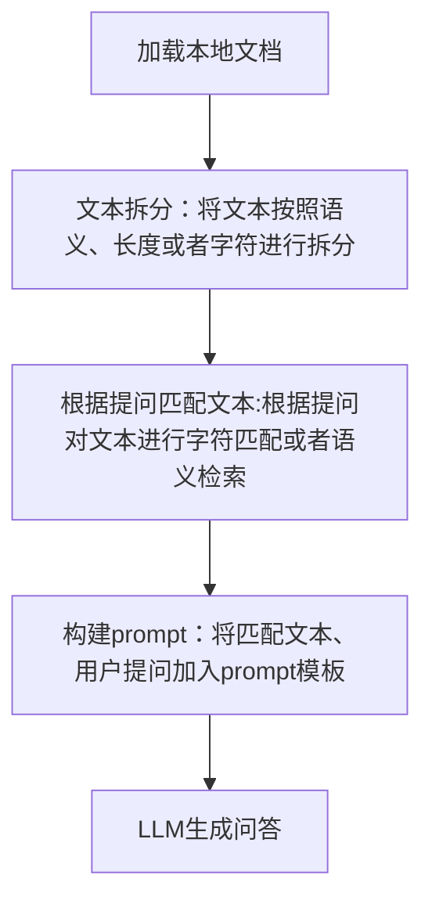

* content
{:toc}

ChatGLM以及结合LongChain的学习笔记

## 微调和提示词工程的适用情况

| | 是什么 | 适用场景 |
|-|-|-|
| 微调 | 针对预先训练的语言模型，在特定任务的少量数据集上对其进行进一步的训练 | 当任务或领域比较明确，并且有足够的标记数据可供训练时，通常使用微调过程 |
| 提示词工程 | 涉及设计自然语言提示或指令，可以指导语言模型执行特定任务 | 最适合需要高精度和明确输出的任务，提示工程可用于制作引发所需输出的查询 |

## LangChain主要功能

- 调用语言模型
- 将不同的数据源介入到语言模型的交互中
- 允许语言模型与运行环境交互

## Long Chain涉及的模块

- Modules: 支持的模型类型的集成
- Promopt: 提示词管理，优化和序列化
- Memory: 内存是指在链/代理调用之间持续存在的状态
- indexes：当语言模型与特定于应用程序数据相结合时，会变得更加强大-该模块包含用于家在、查询和更新外部数据的接口和集成
- Chain：链是结构话的调用序列（对LLM或其他实用程序）
- Agents：代理是一个链，其中LLM在给定高级指令和一组工具的情况下，反复决定操作，执行操作并观察结果，知道高级指令完成
- CallBacks：回调允许您记录和流式传输任何链的中间步骤，从而轻松观察，调试和评估应用程序的内部。

## 单一文档问答的实现原理

